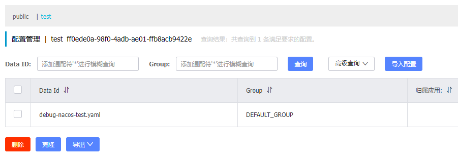

- `gateway-ip:gateway-port/EService/requestPath`
- `gateway-ip:gateway-port/FService/requestPath`

经过网关去掉第二层壳，如`/AService`，并转发给具体的后端服务
```yaml
spring:
  cloud:
    gateway:
      routes:
      - id: a-service
        uri: lb://a-service # 使用负载均衡的方式调用a-service
        predicates:
        - Path=/AService/** # 匹配所有以/AService/开头的请求
        filters:
#        - StripPrefix=1 # 移除路径中的第一个段（即/AService）
        - RewritePath=/AService/(?<segment>.*), /$\{segment} # 截断路径中的/AService/部分
```

- `a-service服务下的requestPath`
- `b-service服务下的requestPath`
- `c-service服务下的requestPath`
- `d-service服务下的requestPath`
- `e-service服务下的requestPath`
- `f-service服务下的requestPath`

由于服务前缀，无论是在测试环境，还是在本地联调，都应该是相同的，因此方式2是最方便的，也是最贴近线上测试环境的本地联调方案


## 需求
本地后端服务和测试环境后端服务，启动之后，会以服务实例的形式同时存在于nacos测试命名空间，这就会造成同一个服务出现负载均衡的情况，如果是在多人协作开发情况下，不同人的服务代码都在修改版本各不一致，负载均衡就会对测试环境的前端请求造成严重的情况，有可能路由到了不可用的本地服务

如何避免这种情况？

### 设想1：更换命名空间
在nacos上创建新的命名空间，如temp，本地启动后端的时候，修改配置文件中的命名空间id为temp空间的id，将本地启动的后端服务注册到temp空间

但是我们还需要在temp中部署新的gateway服务和租户权限管理服务M，缺点如下：
- 后端需要手动改配置文件中的命名空间id，增加了修改量,还要记得不要提交，谁手滑提交了就要请喝茶
- 前端需要修改gateway-ip:port，增加了修改量,还要记得不要提交，谁手滑提交了就要请喝茶
- 最无法避免的情况是，由于测试环境资源吃紧，运维不允许部署多份gateway服务和租户权限管理服务M

### 设想2：基于EnvironmentPostProcessor

基于EnvironmentPostProcessor接口和springboot的SPI机制

我们不用切换命名空间，只需要在服务启动的时候，动态的修改服务在nacos上的注册名称，如将AService修改为local-AService-本地ip后缀，

这样就不会和测试环境的服务名称重复，也就不会出现相同服务需要负载均衡的情况

local-AService-本地ip后缀，之所以加本地ip后缀，是为了在协作开发场景下，区分不同人的本地服务

现在，前端只需要将服务前缀修改为local-AService-本地ip后缀即可，后端不用做任何修改，即可通过网关的方式进行本地的前后端联调！

## 实现

### 基于EnvironmentPostProcessor的具体实现

### 注册中心
- nacos的配置信息一般写在bootstrap.yml中，要开启bootstrap.yml我们需要引入spring-cloud-starter-bootstrap依赖
- 实现EnvironmentPostProcessor接口，重写postProcessEnvironment方法，在springboot启动的开始阶段捕捉配置文件信息，修改spring.application,name服务名称，这也就修改了nacos注册的服务名称（我们只在本地Windows环境下修改服务的注册行为，注意实现的时候避免在线上Linux环境下生效）
- SPI机制，我们需要在src/main/resources/META-INF/spring.factories中写入自定义的EnvironmentPostProcessor实现的路径（尽管在最新版本的springboot3+中使用了src/main/resources/META-INF/spring/org.springframework.boot.autoconfigure.AutoConfiguration.imports，但这是写自动配置类AutoXXXConfiguration的，我们的EnvironmentPostProcessor并不属于自动配置类，因此还是要写在spring.factories，写在org.springframework.boot.autoconfigure.AutoConfiguration.imports中无效）

### 配置中心
只有引入依赖spring-cloud-starter-alibaba-nacos-config，配置中心才会生效

配置中心的配置最好加上下面两个配置项

- file-extension: yaml：指定配置中心配置文件的后缀格式，注意指定了yaml,就不能在配置中心创建yml
- prefix: ${spring.application.name}：指定配置中心配置文件的前缀格式，一般是服务名称spring.application.name

最终的配置文件的命名格式就是prefix-profile.yaml



同时我们在本地创建[application-local.yml](src%2Fmain%2Fresources%2Fapplication-local.yml)，本地的application-local.yml不需要以yaml结尾

现在我们就可以激活指定的profile：local/test来切换不同环境的配置文件了，同时[bootstrap.yml](src%2Fmain%2Fresources%2Fbootstrap.yml)是所有环境公用的配置文件

# 题外话，如何进行远程业务代码调试
很多时候我们需要复现线上bug，这个时候必须使用线上相关的上下游数据，模拟真实的线上环境，此时如何对线上的服务进行远程调试
- 关闭EnvironmentPostProcessor
- 以local的方式启动本地服务，并注册到nacos
- 在nacos服务列表面板根据服务实例ip区分，下线线上服务
- 在nacos服务列表面板根据服务实例ip区分，上线自己的本地服务
- 本地代码打上断点

即可